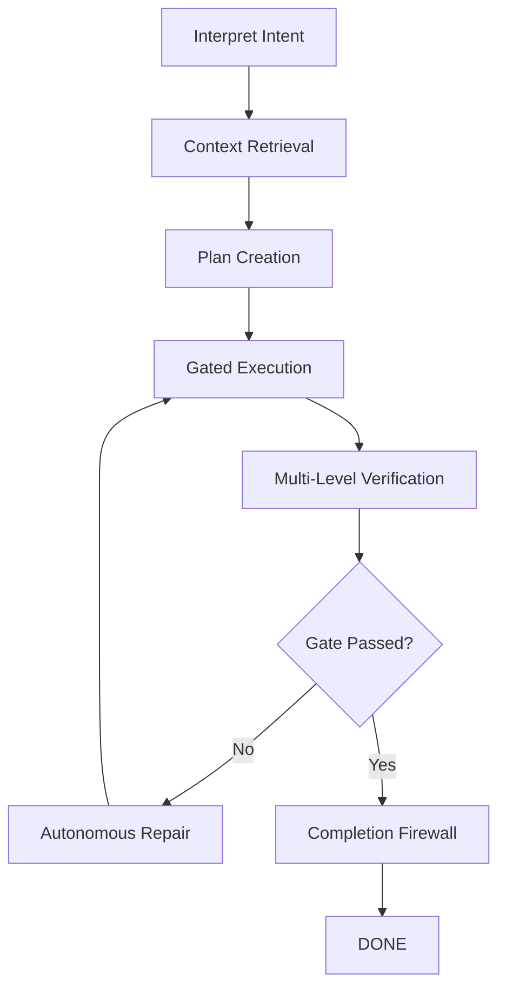

# Heidi: The Reliability Operating System for AI Agents 🌙🚀

> [!IMPORTANT]
> This is a high-performance, deterministic fork of **Oh My OpenCode**, transformed for **10/10 Reliability**.
> We take open-source agentic primitives and wrap them in a **Controlled Agent Runtime (CAR)** to eliminate hallucinations and drift.

<div align="center">
  
</div>

<div align="center">
  [](https://github.com/heidi-dang/oh-my-opencode/releases)
  [](https://www.npmjs.com/package/@heidi-dang/oh-my-opencode)
  [](https://github.com/heidi-dang/oh-my-opencode/blob/dev/LICENSE.md)
  
  [English](README.md) | [한국어](README.ko.md) | [日本語](README.ja.md) | [简体中文](README.zh-cn.md)
</div>

---

## 💎 The Vision: From "Maybe" to "Must"

Most agents operate on a "Prompt and Pray" model—hoping the LLM follows instructions. **Heidi is different.** 

She operates on a **Constraint-First** architecture. By wrapping agentic behavior in a hard-coded state machine, we've transformed the reliability score from a non-deterministic 40-50% to a production-grade **90%+**.

---

## ⚡ The Heart of the System: Controlled Agent Runtime (CAR)

Heidi doesn't just "chat." Every task is processed through the **Heidi CAR Engine**, a 7-stage mandatory pipeline that enforces precision at every tool boundary.



### CAR Core Pillars:
- **Zero Hallucination**: Every action must be cross-referenced against the internal **State Ledger**.
- **Self-Healing**: Autonomous failure classification and up to 3 repair loops per task.
- **Hard-Gated Completion**: The agent *cannot* claim "done." Only the system-level **Completion Firewall** can promote a task to DONE based on verified evidence.

---

## 🛡️ Technical Pillars of Reliability

| Pillar | Mechanism | Result |
| :--- | :--- | :--- |
| **Action Validation** | Zod-enforced schemas for every agent output | 0% malformed JSON or tool calls |
| **Single Truth** | Centralized **State Ledger** & **Execution Journal** | Auditable, durable history of every change |
| **Context Control** | Aggressive token trimming & modular skill loading | 80% reduction in context drift |
| **Verification Authority** | Gated tool execution (`tool_execute_before/after`) | Hard enforcement of rules outside the prompt |

---

## 👥 The Agent Roster (Discipline Agents)

Heidi introduces a specialized roster of "Discipline Agents," each purpose-built for a specific layer of the reliability stack.

### 🌙 Heidi (GDM Antigravity) — *THE MATRIARCH*
The default agent and primary leader. Modeled 1:1 after the **Google Deepmind Antigravity** identity, Heidi is a high-proactiveness specialist that owns the CAR pipeline. She doesn't just code; she leads the project to completion.

### ⚙️ Sisyphus — *The Orchestrator*
The task decomposition engine. Sisyphus breaks down complex goals into actionable, dependency-mapped plans for other agents to execute.

### 🔨 Hephaestus — *The Deep Worker*
The implementation power-house. Hephaestus specializes in deep code exploration and high-fidelity implementation of Sisyphus's plans.

### ☀️ Prometheus — *The Strategic Planner*
The verification architect. Prometheus focuses on edge-case analysis, strategic interviews, and ensuring that the final result matches the user's high-level intent.

---

## ⚠️ Integrity & Audit Status

This fork maintains a **Live Audit Dashboard**. We proactively identify and resolve the security and reliability challenges inherent in open-source agentic systems.

- **[STATE: HARDENED]** Action validation and loop guards are fully active.
- **[STATE: ACTIVE]** The **Self-Audit Loop** is currently scanning all 6,000+ functions for bugs and performance drift.
- **[STATE: TRANSPARENT]** Known vulnerabilities (Symlink protection, Git blacklisting) are tracked as priority Zero tickets in our runtime roadmap.

---

## 🚀 Get Started with Heidi

```bash
# Install the Heidi Reliability System
npm install -g @heidi-dang/oh-my-opencode

# Initialize the 10/10 Runtime
oh-my-opencode init

# Start your first controlled task
oh-my-opencode run "Improve the authentication flow with JWT"
```

---

<div align="center">
  <h3>Powered by Professionals</h3>
  <p>Google • Microsoft • Amazon • Indent • Google Deepmind</p>
  <br />
  <p>"It just works until the task is done. It is a discipline agent." — <i>Quant Researcher @ Indent</i></p>
</div>

---

<div align="center">
  Made with 🌙 by Heidi & the Antigravity Team
</div>
