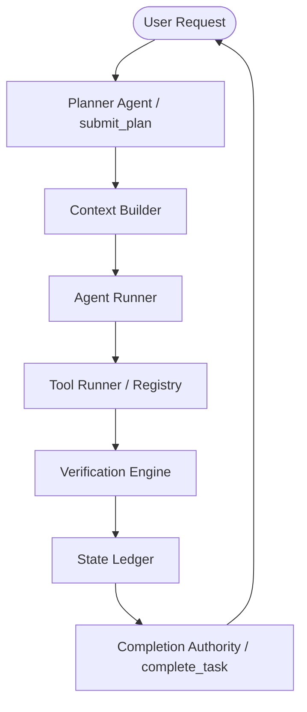

# Deterministic Reliability Runtime Implementation

This document outlines the architecture and enforcement mechanisms of the 10/10 Reliability Runtime for autonomous agents.

## System Architecture

The following diagram illustrates the flow of a deterministic agent turn:



## Core Components

### 1. Agent Lifecycle (PLAN -> EXECUTE -> VERIFY -> REPORT)
Agents follow a strict sequential pipeline. Hallucinations or free-text state claims are rejected at the edge.

### 2. Runtime Authority Boundary
The LLM is forbidden from declaring "Task Complete" or "PR Created". Only the `complete_task` tool, which reads the `StateLedger`, generates the authoritative final success report.

### 3. State Ledger & Execution Journal
- **State Ledger**: The single source of truth for all verified system changes (git commits, file writes, pushes).
- **Execution Journal**: A deterministic log of every action, argument, and result for auditing and replay.

### 4. Tool Execution Contract
All tools must return a structured object:
```typescript
{
  success: boolean;
  verified: boolean;
  changedState: boolean;
  stdout: string;
  stderr: string;
}
```
Mismatches in metadata (e.g., claiming success without verification) trigger a runtime abort.

### 5. Deterministic Verification Engine
Verification is centralized. Agents do not write their own verification commands; they invoke a `verify_action` tool which uses pre-defined check scripts.

### 6. Semantic Loop Guard
Detects repetitive fail-retry patterns by hashing the current goal, active plan step, and state delta. Aborts execution if a loop is detected (>3 iterations).

### 7. Token-Efficient Prompt Architecture
- **Prompt Modularization**: Prompts are split into `base-system`, `execution-rules`, etc.
- **Context Trimmer**: Aggressively summarizes large file reads and terminal outputs.
- **Dynamic Context Builder**: Lazy-loads only the necessary skill context for the active step.
